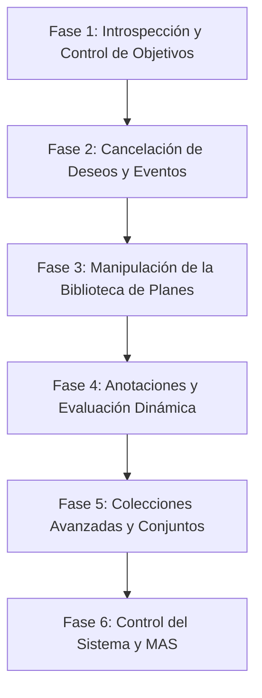

# Plan de Trabajo: Implementación de la Stdlib de AgentSpeak

Este documento detalla el plan de trabajo propuesto para completar las funcionalidades pendientes de la biblioteca estándar (`stdlib.py`) de **python-agentspeak**, tomando como referencia la especificación oficial de **Jason**.

El plan se divide en **6 fases lógicas** diseñadas para ir incrementando las capacidades del intérprete de forma incremental y ordenada, permitiendo probar cada bloque de forma aislada.

---

## 📅 Resumen de Fases

---

## 🛠️ Detalle de las Fases

### Fase 1: Introspección BDI y Control de Objetivos
Esta fase implementa la capacidad del agente para inspeccionar sus intenciones activas y modificar el flujo de ejecución de sus metas actuales.

*   **Funcionalidades a integrar:**
    *   `.current_intention(I)`: Obtiene la representación de la intención que se está ejecutando actualmente.
    *   `.intend(G, [I])`: Comprueba si la meta `G` está en las intenciones del agente (y opcionalmente recupera la pila de intención `I`).
    *   `.desire(D, [I])`: Comprueba si `D` es un deseo activo (ya sea como evento pendiente o meta dentro de una intención).
    *   `.succeed_goal(G)`: Fuerza la consecución exitosa de una meta `G`, abortando los planes asociados en la intención.
    *   `.fail_goal(G)`: Fuerza el fallo de la meta `G`, activando el mecanismo de recuperación de fallos (`-!G`).

### Fase 2: Limpieza de Estado BDI (Dropping)
Permite al agente abortar y descartar de forma masiva o selectiva deseos, intenciones y eventos pendientes.

*   **Funcionalidades a integrar:**
    *   `.drop_desire(D)`: Elimina un deseo `D` y cancela todas las intenciones y eventos relacionados con su consecución.
    *   `.drop_all_desires`: Elimina todos los deseos del agente.
    *   `.drop_intention(I)`: Elimina una intención específica.
    *   `.drop_all_intentions`: Elimina todas las intenciones activas.
    *   `.drop_event(E)`: Elimina un evento específico de la cola de eventos.
    *   `.drop_all_events`: Limpia por completo la cola de eventos pendientes del agente.

### Fase 3: Manipulación y Consulta de la Biblioteca de Planes
Introduce la posibilidad de aprender, olvidar y consultar planes en tiempo de ejecución.

*   **Funcionalidades a integrar:**
    *   `.add_plan(PlanString/PlanTerm, [Source], [Position])`: Añade dinámicamente un plan (representado como cadena o término estructurado) al agente.
    *   `.remove_plan(PlanLabel)`: Elimina un plan utilizando su etiqueta identificativa.
    *   `.plan_label(Plan, Label)`: Obtiene o unifica la etiqueta de un plan determinado.
    *   `.relevant_plans(Trigger, List)`: Recupera todos los planes de la biblioteca que coinciden con un evento desencadenante.
    *   `.relevant_plan(Trigger)`: Versión basada en backtracking de `.relevant_plans`.
    *   `.list_plans`: Imprime/vuelca la biblioteca de planes actual (útil para depuración).

### Fase 4: Manipulación de Términos, Anotaciones y Cadenas
Mejora la manipulación sintáctica y la reflexión sobre los términos internos de AgentSpeak.

*   **Funcionalidades a integrar:**
    *   `.add_annot(Literal, Annotation, Result)`: Añade una anotación a un literal si no existía previamente.
    *   `.add_nested_source(Literal, Source, Result)`: Inserta anotaciones de fuente anidadas.
    *   `.remove_source_annot(Literal, Result)`: Elimina las anotaciones relativas a la fuente de información.
    *   `.term2string(Term, String)`: Conversión bidireccional entre términos AST de AgentSpeak y representaciones de cadena.
    *   `.copy_term(Term, Copy)`: Realiza una copia profunda del término, renombrando variables para evitar colisiones.
    *   `.eval(Result, LogicalExpression)`: Evalúa dinámicamente una expresión lógica a un valor de verdad.

### Fase 5: Operaciones Avanzadas sobre Listas y Conjuntos
Amplía las funciones básicas de listas de python-agentspeak para equipararlas a Jason.

*   **Funcionalidades a integrar:**
    *   `.empty(List)`: Comprueba si una lista o cadena está vacía.
    *   `.delete(Element, List, Result)`: Elimina todas las ocurrencias de un elemento en una lista.
    *   `.reverse(List, Result)`: Invierte el orden de los elementos.
    *   `.shuffle(List, Result)`: Desordena aleatoriamente una lista.
    *   `.suffix(Suffix, List)` / `.prefix(Prefix, List)` / `.sublist(Sublist, List)`: Comprobación y backtracking de sub-secuencias.
    *   `.union(S1, S2, S3)` / `.intersection(S1, S2, S3)` / `.difference(S1, S2, S3)`: Operaciones de teoría de conjuntos utilizando listas.

### Fase 6: Control de MAS y Entorno (Sistema)
Permite interactuar con la plataforma y planificar eventos temporales.

*   **Funcionalidades a integrar:**
    *   `.create_agent(Name, SourcePath)`: Compila y arranca un nuevo agente en el entorno actual.
    *   `.kill_agent(Name)`: Detiene y elimina un agente por su nombre.
    *   `.all_names(List)`: Recupera los nombres de todos los agentes activos en el sistema.
    *   `.at(Time, Event)`: Programa la ejecución de un evento tras un retraso de tiempo determinado.
    *   `.perceive`: Fuerza al agente a actualizar de forma inmediata sus creencias a partir de las percepciones del entorno.
    *   `.println` / `.puts` / `.printf`: Extensiones del sistema de impresión formateada estándar de Jason.

---

## 🚫 Funcionalidades que quedan Fuera del Alcance (Excluidas)

| Acción Excluida | Razón de Exclusión |
| :--- | :--- |
| **Facilitador de Directorio (`.df_register`, `.df_deregister`, `.df_search`, `.df_subscribe`)** | Requiere una infraestructura de plataforma MAS basada en FIPA (como JADE). `python-agentspeak` es un motor de ejecución local y no proporciona un DF en su núcleo. |
| **Directivas de Concurrencia (`.fork`, `.join`)** | Requieren modificaciones profundas en el parser y el compilador del AST de `python-agentspeak` para dar soporte sintáctico a la ejecución paralela inline. |
| **Serialización de Agente (`.save_agent`, `.clone`)** | Muy ligadas al sistema de serialización de Java (JVM) y el guardado de hilos de ejecución activos. En Python, los agentes tienen manejadores de archivos/corrutinas abiertos que impiden una serialización directa. |
| **Estructuras de Datos Java (`.map.*`, `.set.*`, `.queue.*`)** | Jason las proporciona exponiendo clases Java del SDK. En `python-agentspeak` es preferible trabajar sobre listas nativas (tuplas) u objetos integrados, y delegar estructuras más complejas a extensiones específicas en Python. |
